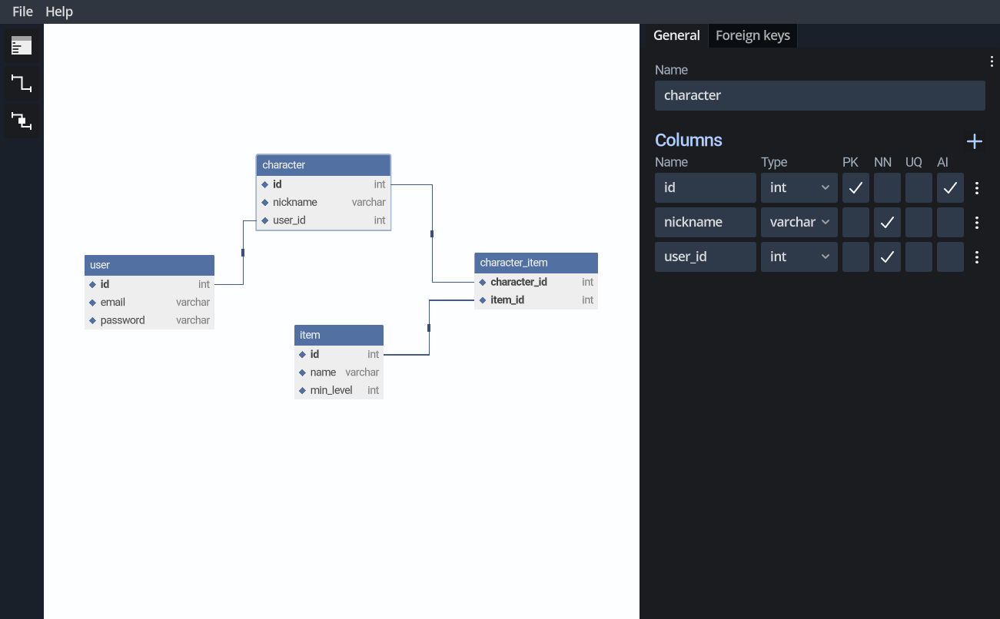

# Schemer

Schemer is a free and open source Entity Relationship Diagram editor made in Godot 4.

## Download

You can try the web version [here](https://editor.schemer.gg) or download the latest releases [here](https://github.com/Eranot/schemer/releases) (coming soon).
